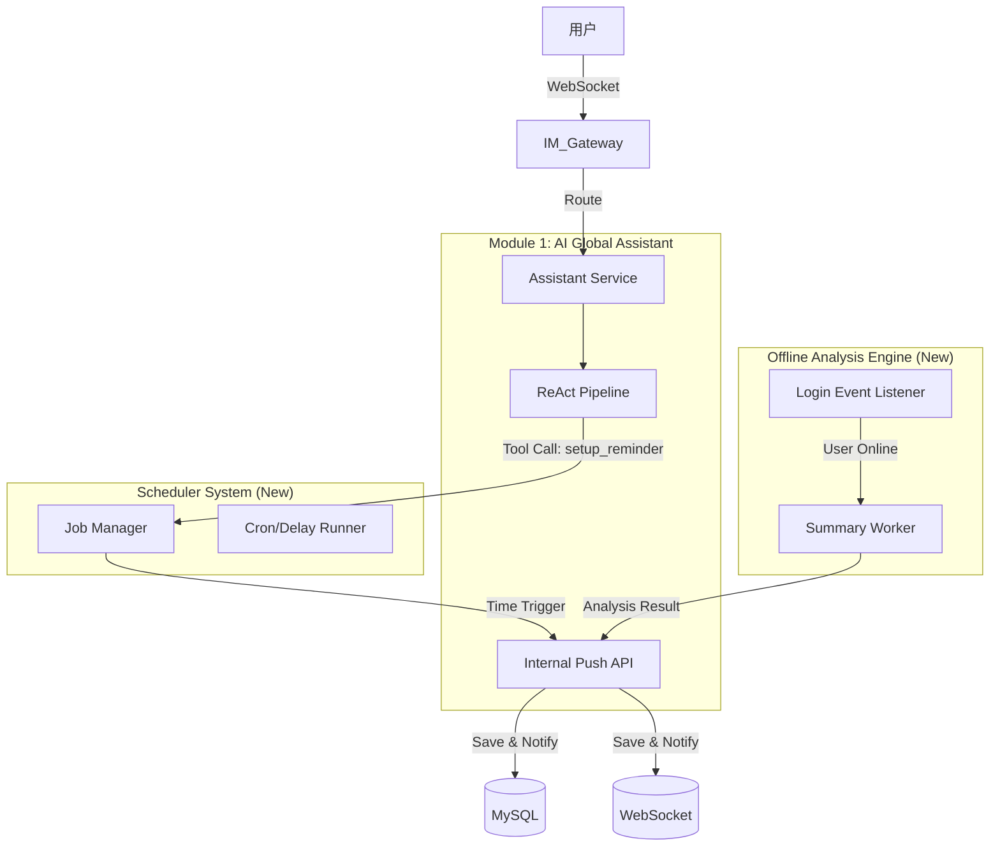

# 全局 AI 个人助手功能完善与主动交互技术方案

## 1. 方案概述

本方案旨在完善 OmniLink 模块一（全局 AI 个人助手），在现有全域 RAG 和 ReAct 能力基础上，赋予系统**“主动性”**和**“时间感知”**能力。核心目标是打破“用户提问-AI回答”的被动交互模式，构建一套支持**离线总结**、**定时任务触发**、**系统主动通知**的闭环架构。

### 1.1 核心设计理念

*   **统一人格出口 (Single Persona Interface)**：所有系统级的通知、提醒、总结，必须统一通过“全局 AI 助手”的身份触达用户。用户感觉是在与一个全能管家交互，而不是面对分散的系统通知。
*   **事件驱动架构 (Event-Driven Architecture)**：通过消息队列和事件总线解耦“触发源”（如定时器、登录事件）与“执行端”（AI 助手）。
*   **AI Native 指令 (LLM-based Command)**：利用现有的 ReAct 模式处理 `/todo` 等指令，而非硬编码正则匹配，确保对自然语言参数（如“明早十点”）的高级理解能力。

---

## 2. 总体架构设计

系统将新增或增强以下三个核心子系统，与现有的 `AssistantService` 进行深度融合。

### 2.1 架构图示



---

## 3. 核心模块详细设计

### 3.1 内部主动推送接口 (Internal Push API)

这是让全局助手“主动开口”的喉舌。目前 `Chat` 接口是同步响应式的，需新增异步推送能力。

*   **功能定义**：允许系统内部其他模块（Scheduler, Workers）以“全局助手”的身份向指定用户发送消息。
*   **接口设计**：
    *   方法：`PushMessage(ctx, tenantUserID, content, options)`
    *   参数 `options`：包含 `MsgType` (提醒/总结/普通)、`Payload` (跳转链接/结构化数据)、`Source` (触发源)。
*   **数据流向**：
    1.  接收内部调用请求。
    2.  构造 `AIAssistantMessage`，标记 `Role=assistant`。
    3.  **关键点**：设置消息元数据 `metadata_json`，标记 `trigger_source`（如 `scheduler`, `offline_worker`），以便前端通过不同样式渲染（如提醒卡片、摘要日报）。
    4.  持久化至 `ai_assistant_message` 表。
    5.  调用 IM 模块的 `RealtimeService` 通过 WebSocket 推送给用户端。

### 3.2 智能指令与调度系统 (Command & Scheduler)

利用 AI 的理解能力处理 `/todo` 指令，实现从自然语言到定时任务的转化。

*   **指令解析 (Parsing)**：
    *   **方案**：复用现有的 **ReAct 模式**。不单独写正则解析器。
    *   **实现**：新增一个 MCP Tool `manage_schedule`。
    *   **Prompt 增强**：在 System Prompt 中加入指令说明：“当用户输入 /todo 或表达定时意图时，调用 manage_schedule 工具。”
    *   **优势**：支持模糊时间（“明早开会” -> AI 自动解析为 "202x-xx-xx 09:00:00"），无需硬编码时间解析逻辑。

*   **任务调度 (Scheduling)**：
    *   **存储**：新增 `sys_job` 表，存储 `job_id`, `user_id`, `cron_expression/execute_at`, `callback_payload`。
    *   **执行器**：
        *   使用 Go 标准库的时间轮或高性能 Cron 库（如 `robfig/cron`）加载近期任务。
        *   对于分布式部署，建议使用 Redis ZSet 实现轻量级延时队列，或引入专门的消息队列延迟投递。
    *   **回调逻辑**：
        *   任务到期 -> 触发 Executor -> 解析 `callback_payload` -> 调用 **3.1 内部推送接口** -> 发送“🔔 提醒：您该去开会了”。

### 3.3 离线总结引擎 (Offline Summary Engine)

在用户回归时，主动呈递“情报”。

*   **触发机制**：
    *   监听 `UserLogin` 事件（需在 User 模块发布该事件）。
*   **执行流程**：
    1.  **Diff 计算**：获取用户 `LastOfflineAt` 时间点。
    2.  **数据聚合**：检索该时间点之后的所有 **关注群组** 和 **重要私聊** 的消息记录。
    3.  **AI 分析**：
        *   调用 LLM 进行摘要生成。
        *   Prompt 模板：“你是一个秘书，以下是用户离线期间的消息，请按重要性生成简报...”
    4.  **结果推送**：
        *   调用 **3.1 内部推送接口**。
        *   消息类型标记为 `offline_summary`，前端可渲染为一张精美的“日报卡片”。

---

## 4. 数据库设计变动方案

为了支持上述功能，需对现有表结构进行扩展（遵循扩展性原则，不破坏现有字段）。

### 4.1 消息表扩展 (ai_assistant_message)
利用现有的 `metadata_json` 字段存储结构化信息，无需加列。
*   `metadata_json` 结构定义：
    ```json
    {
      "trigger_source": "scheduler | offline_worker | user_chat",
      "msg_type": "text | card | reminder",
      "payload": {
        "job_id": "xxx",        // 关联的任务ID
        "summary_range": "..."  // 总结的时间范围
      }
    }
    ```

### 4.2 新增任务表 (ai_schedule_job)
用于持久化定时任务。
```sql
CREATE TABLE `ai_schedule_job` (
  `id` bigint NOT NULL AUTO_INCREMENT,
  `job_id` char(20) NOT NULL,
  `tenant_user_id` char(20) NOT NULL,
  `agent_id` char(20) NOT NULL,       -- 哪个Agent创建的任务
  `execute_at` datetime NOT NULL,     -- 执行时间
  `content` text NOT NULL,            -- 提醒内容
  `status` tinyint DEFAULT 0,         -- 0:pending, 1:executed, 2:cancelled
  `created_at` datetime NOT NULL,
  PRIMARY KEY (`id`),
  INDEX `idx_execute_at` (`execute_at`) -- 用于扫描近期任务
);
```

---

## 5. 详细实现步骤

### 第一步：基础设施建设 (Internal Push)
1.  **定义 DTO**：在 `internal/modules/ai/application/dto` 中定义 `InternalPushRequest`。
2.  **实现 Service 方法**：在 `AssistantService` 中实现 `PushMessage` 方法。
    *   该方法不经过 Pipeline 的 ChatModel 节点。
    *   直接经过 Pipeline 的 Persist 节点（或者复用 Repository 逻辑）进行存储。
    *   调用 `RealtimeService` 推送 WS 消息。
3.  **单元测试**：验证可以通过代码直接向特定用户的助手会话插入一条消息。

### 第二步：调度系统实现 (Scheduler)
1.  **创建 Job 领域**：在 `internal/modules/ai/domain/job` 定义实体和 Repository。
2.  **开发 MCP Tool**：
    *   实现 `ScheduleTool`，包含 `CreateReminder(time, content)` 函数。
    *   在 Tool 内部将任务写入 `ai_schedule_job` 表。
3.  **注册 Tool**：将新 Tool 注册到 `AssistantPipeline` 的 Tools 列表中。
4.  **实现 Job Runner**：
    *   启动一个后台 Goroutine (Ticker)。
    *   每分钟扫描 `ai_schedule_job` 中 `status=0` 且 `execute_at <= now` 的任务。
    *   遍历任务，调用 `AssistantService.PushMessage` 发送提醒。
    *   更新任务状态为 `executed`。

### 第三步：离线总结实现 (Offline Worker)
1.  **事件订阅**：在 `internal/modules/ai/interface/consumer` 中实现 `LoginEventConsumer`。
2.  **开发 Summary Service**：
    *   实现 `GenerateOfflineSummary(userId, lastOfflineTime)`。
    *   复用 `RetrievePipeline` 或直接查询 `MessageRepository` 获取未读消息。
    *   构建专门的 Summarization Prompt，调用 `ChatModel` 生成摘要。
3.  **串联流程**：
    *   Consumer 收到登录事件 -> 触发异步 Goroutine -> 调用 Summary Service -> 获取摘要文本 -> 调用 `PushMessage`。

### 第四步：前端协议适配 (Compatibility)
1.  **WS 协议扩展**：确保前端能解析 `metadata_json` 中的 `msg_type`。
2.  **UI 渲染**：
    *   `msg_type=reminder`：渲染为带闹钟图标的提醒气泡。
    *   `msg_type=offline_summary`：渲染为Markdown格式的日报卡片。

---

## 6. 扩展性与未来兼容

1.  **多 Agent 兼容**：
    *   `PushMessage` 接口设计包含 `agent_id` 参数。未来不仅是“全局助手”，用户自定义的 Agent（如“英语老师”）也可以通过 Job 触发主动发消息（如“该背单词了”）。
2.  **复杂指令兼容**：
    *   当前使用 ReAct 处理 `/todo`，未来如果需要处理 `/search` 或 `/brainstorm`，只需增加对应的 MCP Tool，架构无需变动。
3.  **消息类型扩展**：
    *   基于 `metadata_json` 的设计完全兼容未来 GenUI (模块五)。例如，未来 Job 触发的不仅是文本，可以是一个 React 组件 JSON（投票卡片），只需在 metadata 中标记 `render_type: widget`。

