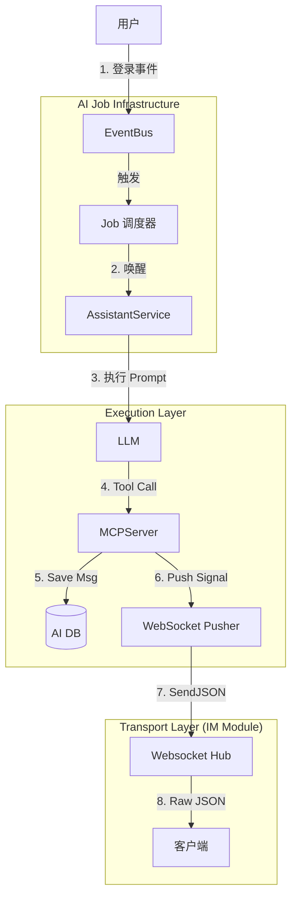

# AI 模块重构与通用任务系统设计方案 (v2 - Decoupled Push)

## 1. 背景与目标

当前 AI 模块设计（Module 1 & 4）涉及“离线总结”、“主动通知”、“智能指令”等功能。为了避免为每个功能单独开发一套逻辑，本方案旨在设计一套**通用的 AI-Job System**。

核心原则：**AI 逻辑与 IM 逻辑解耦，但复用传输通道。**

## 2. 核心架构设计：AI-Job System

### 2.1 核心理念
统一抽象为 **AI Job**：
*   **Trigger (触发器)**：Cron / Event。
*   **Actor (执行者)**：Agent。
*   **Payload (指令)**：Prompt。
*   **Action (动作)**：Persist to AI DB + Push via WS (No IM DB pollution).

### 2.2 架构组件



### 2.3 数据流 (关键差异)

与普通 IM 消息不同，AI 主动通知的数据流如下：

1.  **Storage**: 消息内容存储在 `ai_assistant_message` 表中（与用户主动问 AI 的回复存在同一张表），保证 AI 上下文连贯。
2.  **IM DB**: **不写入** `message` 表。IM 模块完全不知道这条消息的存在。
3.  **Transport**: 借用 IM 模块建立的 WebSocket 长连接通道。
4.  **Protocol**: 推送一种特殊类型的 WebSocket 消息：
    ```json
    {
      "type": "ai_event",
      "event": "new_message",
      "data": {
        "session_id": "...",
        "content": "...",
        "agent_id": "..."
      }
    }
    ```

---

## 3. 详细实施方案 (Step-by-Step)

### Phase 1: 基础设施 (Infrastructure)

**Step 1.1: Job 领域模型**
*   **File**: `internal/modules/ai/domain/job/entity.go`
*   **Struct**: `AIJob` (ID, TriggerType, CronExpr, TargetAgentID, Prompt, Status).
*   **Interface**: `JobRepository`.

**Step 1.2: 简易调度器**
*   **File**: `internal/modules/ai/infrastructure/scheduler/poller.go`
*   **Logic**: 每分钟轮询 DB 中 `status=pending AND trigger_at <= now` 的任务 -> 投递给 `AssistantService`。

**Step 1.3: Assistant Service 扩展**
*   **Method**: `ExecuteJob(ctx, jobID)`
*   **Logic**:
    1.  加载 Agent 和 Job Prompt。
    2.  构造 Pipeline Request (Source=Job)。
    3.  执行 LLM。
    4.  **如果 LLM 返回文本回复** -> 调用 `PushService` 推送给用户。

### Phase 2: 推送通道改造 (Push Channel)

**Step 2.1: 开放 WebSocket 推送接口**
*   **Module**: `chat`
*   **File**: `internal/modules/chat/application/service/realtime_service.go`
*   **Add Method**: `PushSystemEvent(userID string, eventType string, payload interface{}) error`
*   **Impl**: 直接调用 `hub.SendJSON(userID, {type: eventType, data: payload})`。

**Step 2.2: 实现 AI 推送工具 (MCP)**
*   **Module**: `ai`
*   **Tool**: `push_notification`
*   **Logic**:
    1.  Save message to `ai_assistant_message` (ensure it appears in AI history).
    2.  Call `RealtimeService.PushSystemEvent(userID, "ai_notification", msgDTO)`.

### Phase 3: 业务场景实现

**Step 3.1: 离线总结 (Offline Summary)**
*   **Trigger**: 监听 `UserLogin` 事件。
*   **Job**: Create `AIJob{ Prompt: "Call retrieve_offline_msgs tool, summarize, then call push_notification tool." }`.
*   **MCP**: 实现 `retrieve_offline_msgs` 工具 (Read IM DB via `MessageRepository`).

**Step 3.2: 定时提醒 (Smart Command)**
*   **User Input**: "/remind 8am meeting"
*   **Agent**: Calls `schedule_job` tool.
*   **Tool**: Inserts `AIJob{ TriggerAt: 8am, Prompt: "Call push_notification tool: 'Time for meeting!'" }`.

### Phase 4: 前端融合 (Frontend)

**Step 4.1: WebSocket Dispatcher**
*   **Logic**: 
    *   收到 WS 消息。
    *   `if msg.type == "ai_notification"` -> 写入本地 AI Store -> 触发 UI 更新（小红点/Toast）。
    *   `else` -> 走原有 IM 逻辑。

**Step 4.2: 统一会话列表**
*   **UI**: 在 IM 列表渲染 AI Session。
*   **Data Source**: 混合数据源 (IM DB + AI DB)。或者前端本地统一存储（Local DB）。

## 4. 总结

本方案满足“退而求其次”的要求：
1.  **Zero Pollution**: User/Message 表完全纯净。
2.  **Reuse**: 复用 WebSocket 通道。
3.  **Consistency**: AI 历史记录完整存储在 AI 模块，不依赖 IM 存储。

此方案实现了 AI 与 IM 的“逻辑隔离，物理融合”。
