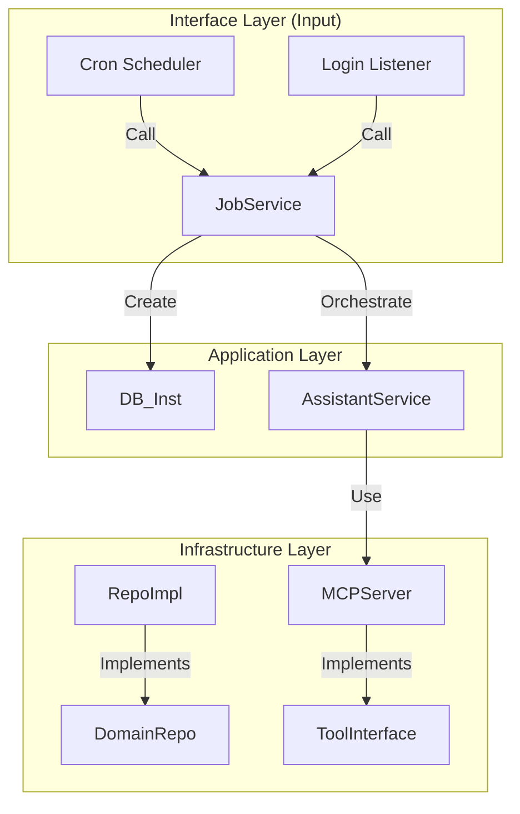

# AI 模块重构与通用任务系统设计方案 (v5 - Smart Command & MCP)

## 1. 背景与目标

当前 AI 模块设计（Module 1 & 4）涉及“离线总结”、“主动通知”、“智能指令”等功能。为了实现一套高内聚、低耦合、可扩展的任务系统，本方案采用 **"定义与实例分离"** 的架构模式。

核心原则：
1.  **AI 逻辑与 IM 逻辑解耦**：只复用 WebSocket 通道，不污染 IM 数据库。
2.  **规则与执行分离**：将“任务规则（Cron/Event）”与“执行记录（Instance）”分开存储。
3.  **去 Redis 依赖**：利用 Go 内存调度 + MySQL 持久化 + Channel 事件总线，构建轻量级调度系统。
4.  **智能指令支持**：开放 MCP 工具集，使 AI 能够自主创建和管理任务。

## 2. 核心架构设计

### 2.1 核心理念：生产者-消费者模型

整个系统分为三层（严格遵循 DDD）：

1.  **接口层 (Interface / Driving Adapters)**：系统的入口。
    *   **Cron Job (Scheduler)**：时间驱动入口。
    *   **Event Listener**：事件驱动入口。
    *   **HTTP Handler**：API 驱动入口。
2.  **应用层 (Application)**：编排业务逻辑。
    *   **Job Service**：协调 Repo 和 Agent Service。
    *   **Assistant Service**：执行 AI 核心逻辑。
3.  **领域层 (Domain) & 基础设施层 (Infrastructure)**：
    *   **Domain**: 实体 (Def/Inst) 和 接口 (Repo Interface)。
    *   **Infrastructure**: 数据库实现 (GORM)、MCP 工具实现。

### 2.2 架构组件图



---

## 3. 详细实施方案

### 3.1 领域模型层 (Domain Layer)

路径：`internal/modules/ai/domain/job/entity.go`

```go
package job

import (
	"time"
)

// 任务类型
const (
	TriggerTypeOnce  = 0 // 一次性任务 (Time Delay)
	TriggerTypeCron  = 1 // 定时任务 (Recurring)
	TriggerTypeEvent = 2 // 事件驱动
)

// 任务执行状态
const (
	JobStatusPending   = 0 // 待执行
	JobStatusRunning   = 1 // 执行中
	JobStatusCompleted = 2 // 完成
	JobStatusFailed    = 3 // 失败
)

// AIJobDef (任务定义/规则)
type AIJobDef struct {
	ID           int64     `gorm:"column:id;primaryKey;autoIncrement"`
	TenantUserID string    `gorm:"column:tenant_user_id;index;type:varchar(64)"` // 规则归属人
	AgentID      string    `gorm:"column:agent_id;not null;type:varchar(64)"`    // 执行的 Agent
	Title        string    `gorm:"column:title;type:varchar(100)"`
	TriggerType  int       `gorm:"column:trigger_type;not null"`        // 0:Once, 1:Cron, 2:Event
	CronExpr     string    `gorm:"column:cron_expr;type:varchar(64)"`   // e.g. "0 8 * * *"
	EventKey     string    `gorm:"column:event_key;type:varchar(64)"`   // e.g. "user_login"
	Prompt       string    `gorm:"column:prompt;type:text"`             // 核心 Prompt
	IsActive     bool      `gorm:"column:is_active;default:true"`       // 是否启用
	CreatedAt    time.Time `gorm:"column:created_at"`
	UpdatedAt    time.Time `gorm:"column:updated_at"`
}

func (AIJobDef) TableName() string {
	return "ai_job_def"
}

// AIJobInst (任务实例/执行日志)
type AIJobInst struct {
	ID            int64      `gorm:"column:id;primaryKey;autoIncrement"`
	JobDefID      int64      `gorm:"column:job_def_id;index"`   // 关联的规则ID
	TenantUserID  string     `gorm:"column:tenant_user_id;index;type:varchar(64)"` 
	AgentID       string     `gorm:"column:agent_id;type:varchar(64)"`             
	Prompt        string     `gorm:"column:prompt;type:text"`     
	Status        int        `gorm:"column:status;default:0;index"`
	TriggerAt     time.Time  `gorm:"column:trigger_at;index"` // 计划执行时间
	StartedAt     *time.Time `gorm:"column:started_at"`
	FinishedAt    *time.Time `gorm:"column:finished_at"`
	RetryCount    int        `gorm:"column:retry_count;default:0"`
	ResultSummary string     `gorm:"column:result_summary;type:text"` // 错误信息或执行简报
	CreatedAt     time.Time  `gorm:"column:created_at"`
}

func (AIJobInst) TableName() string {
	return "ai_job_inst"
}
```

路径：`internal/modules/ai/domain/repository/job_repository.go`

```go
package repository

import (
	"context"
	"OmniLink/internal/modules/ai/domain/job"
)

type AIJobRepository interface {
	// Def CRUD
	CreateDef(ctx context.Context, def *job.AIJobDef) error
	GetActiveCronDefs(ctx context.Context) ([]*job.AIJobDef, error)
	GetDefsByEvent(ctx context.Context, eventKey string) ([]*job.AIJobDef, error) 
    GetDefsByEventAndUser(ctx context.Context, eventKey string, userID string) ([]*job.AIJobDef, error)

	// Inst CRUD
	CreateInst(ctx context.Context, inst *job.AIJobInst) error
	GetPendingInsts(ctx context.Context, limit int) ([]*job.AIJobInst, error)
	UpdateInstStatus(ctx context.Context, id int64, status int, result string) error
	IncrInstRetry(ctx context.Context, id int64) error
}
```

### 3.2 基础设施层 (Infrastructure Layer)

路径：`internal/modules/ai/infrastructure/persistence/job_repository_impl.go`

```go
package persistence

import (
	"context"
	"time"
	"OmniLink/internal/modules/ai/domain/job"
	"OmniLink/internal/modules/ai/domain/repository"
	"gorm.io/gorm"
)

type aiJobRepoImpl struct {
	db *gorm.DB
}

func NewAIJobRepository(db *gorm.DB) repository.AIJobRepository {
	return &aiJobRepoImpl{db: db}
}

func (r *aiJobRepoImpl) CreateDef(ctx context.Context, def *job.AIJobDef) error {
	return r.db.WithContext(ctx).Create(def).Error
}

func (r *aiJobRepoImpl) GetActiveCronDefs(ctx context.Context) ([]*job.AIJobDef, error) {
	var defs []*job.AIJobDef
	err := r.db.WithContext(ctx).
		Where("is_active = ? AND trigger_type = ?", true, job.TriggerTypeCron).
		Find(&defs).Error
	return defs, err
}

func (r *aiJobRepoImpl) GetDefsByEvent(ctx context.Context, eventKey string) ([]*job.AIJobDef, error) {
	var defs []*job.AIJobDef
	err := r.db.WithContext(ctx).
		Where("is_active = ? AND trigger_type = ? AND event_key = ?", true, job.TriggerTypeEvent, eventKey).
		Find(&defs).Error
	return defs, err
}

func (r *aiJobRepoImpl) GetDefsByEventAndUser(ctx context.Context, eventKey string, userID string) ([]*job.AIJobDef, error) {
    var defs []*job.AIJobDef
    err := r.db.WithContext(ctx).
        Where("is_active = ? AND trigger_type = ? AND event_key = ? AND tenant_user_id = ?", 
            true, job.TriggerTypeEvent, eventKey, userID).
        Find(&defs).Error
    return defs, err
}

func (r *aiJobRepoImpl) CreateInst(ctx context.Context, inst *job.AIJobInst) error {
    return r.db.WithContext(ctx).Create(inst).Error
}

func (r *aiJobRepoImpl) GetPendingInsts(ctx context.Context, limit int) ([]*job.AIJobInst, error) {
	var insts []*job.AIJobInst
	// 查找待执行且时间已到的任务
	err := r.db.WithContext(ctx).
		Where("status = ? AND trigger_at <= ?", job.JobStatusPending, time.Now()).
		Order("trigger_at ASC").
		Limit(limit).
		Find(&insts).Error
	return insts, err
}

func (r *aiJobRepoImpl) UpdateInstStatus(ctx context.Context, id int64, status int, result string) error {
    updates := map[string]interface{}{
        "status":         status,
        "result_summary": result,
    }
    if status == job.JobStatusRunning {
        updates["started_at"] = time.Now()
    }
    if status == job.JobStatusCompleted || status == job.JobStatusFailed {
        updates["finished_at"] = time.Now()
    }
	return r.db.WithContext(ctx).Model(&job.AIJobInst{}).
		Where("id = ?", id).
		Updates(updates).Error
}

func (r *aiJobRepoImpl) IncrInstRetry(ctx context.Context, id int64) error {
	return r.db.WithContext(ctx).Model(&job.AIJobInst{}).
		Where("id = ?", id).
		UpdateColumn("retry_count", gorm.Expr("retry_count + ?", 1)).Error
}
```

### 3.3 应用层 (Application Service)

路径：`internal/modules/ai/application/service/job_service.go`

```go
package service

import (
	"context"
	"fmt"
	"strings"
	"time"

	"OmniLink/internal/modules/ai/application/dto/request"
	"OmniLink/internal/modules/ai/domain/job"
	"OmniLink/internal/modules/ai/domain/repository"
	"OmniLink/pkg/zlog"
	"go.uber.org/zap"
)

type AIJobService interface {
	TriggerByEvent(ctx context.Context, eventKey string, tenantUserID string, vars map[string]string) error
	CreateInstanceFromDef(ctx context.Context, def *job.AIJobDef) error
	ExecuteInstance(ctx context.Context, inst *job.AIJobInst) error
    CreateOneTimeJob(ctx context.Context, userID string, agentID string, prompt string, triggerAt time.Time) error
    CreateCronJob(ctx context.Context, userID string, agentID string, prompt string, cronExpr string) error
    CreateEventJob(ctx context.Context, userID string, agentID string, prompt string, eventKey string) error
}

type aiJobServiceImpl struct {
	jobRepo      repository.AIJobRepository
	assistantSvc AssistantService
}

func NewAIJobService(repo repository.AIJobRepository, as AssistantService) AIJobService {
	return &aiJobServiceImpl{
		jobRepo:      repo,
		assistantSvc: as,
	}
}

func (s *aiJobServiceImpl) TriggerByEvent(ctx context.Context, eventKey string, tenantUserID string, vars map[string]string) error {
    defs, err := s.jobRepo.GetDefsByEventAndUser(ctx, eventKey, tenantUserID)
    if err != nil {
        return err
    }
    globalDefs, err := s.jobRepo.GetDefsByEvent(ctx, eventKey)
    if err == nil {
        defs = append(defs, globalDefs...)
    }
    if len(defs) == 0 {
        return nil
    }
    for _, def := range defs {
        finalPrompt := def.Prompt
        for k, v := range vars {
            finalPrompt = strings.ReplaceAll(finalPrompt, "{{"+k+"}}", v)
        }
        targetUser := def.TenantUserID
        if targetUser == "" {
            targetUser = tenantUserID
        }
        inst := &job.AIJobInst{
            JobDefID:     def.ID,
            TenantUserID: targetUser,
            AgentID:      def.AgentID,
            Prompt:       finalPrompt,
            Status:       job.JobStatusPending,
            TriggerAt:    time.Now(),
        }
        _ = s.jobRepo.CreateInst(ctx, inst)
    }
    return nil
}

func (s *aiJobServiceImpl) CreateInstanceFromDef(ctx context.Context, def *job.AIJobDef) error {
    inst := &job.AIJobInst{
        JobDefID:     def.ID,
        TenantUserID: def.TenantUserID,
        AgentID:      def.AgentID,
        Prompt:       def.Prompt,
        Status:       job.JobStatusPending,
        TriggerAt:    time.Now(),
    }
    return s.jobRepo.CreateInst(ctx, inst)
}

func (s *aiJobServiceImpl) CreateOneTimeJob(ctx context.Context, userID string, agentID string, prompt string, triggerAt time.Time) error {
    inst := &job.AIJobInst{
        JobDefID:     0,
        TenantUserID: userID,
        AgentID:      agentID,
        Prompt:       prompt,
        Status:       job.JobStatusPending,
        TriggerAt:    triggerAt,
    }
    return s.jobRepo.CreateInst(ctx, inst)
}

func (s *aiJobServiceImpl) CreateCronJob(ctx context.Context, userID string, agentID string, prompt string, cronExpr string) error {
    def := &job.AIJobDef{
        TenantUserID: userID,
        AgentID:      agentID,
        TriggerType:  job.TriggerTypeCron,
        CronExpr:     cronExpr,
        Prompt:       prompt,
        IsActive:     true,
        Title:        "Scheduled Task: " + cronExpr,
        CreatedAt:    time.Now(),
        UpdatedAt:    time.Now(),
    }
    return s.jobRepo.CreateDef(ctx, def)
}

func (s *aiJobServiceImpl) CreateEventJob(ctx context.Context, userID string, agentID string, prompt string, eventKey string) error {
    def := &job.AIJobDef{
        TenantUserID: userID,
        AgentID:      agentID,
        TriggerType:  job.TriggerTypeEvent,
        EventKey:     eventKey,
        Prompt:       prompt,
        IsActive:     true,
        Title:        "Event Task: " + eventKey,
        CreatedAt:    time.Now(),
        UpdatedAt:    time.Now(),
    }
    return s.jobRepo.CreateDef(ctx, def)
}

func (s *aiJobServiceImpl) ExecuteInstance(ctx context.Context, inst *job.AIJobInst) error {
    zlog.Info("executing ai job instance", zap.Int64("inst_id", inst.ID))
    req := request.AssistantChatRequest{
        Question:  inst.Prompt,
        AgentID:   inst.AgentID,
    }
    _, err := s.assistantSvc.ChatInternal(ctx, req, inst.TenantUserID)
    return err
}
```

**File**: `internal/modules/ai/application/service/assistant_service.go` (新增方法)

```go
// 接口定义补充
// ChatInternal 内部调用接口，不依赖 HTTP，不做 Token 校验
ChatInternal(ctx context.Context, req request.AssistantChatRequest, tenantUserID string) (*respond.AssistantChatRespond, error)

// 实现补充
func (s *assistantServiceImpl) ChatInternal(ctx context.Context, req request.AssistantChatRequest, tenantUserID string) (*respond.AssistantChatRespond, error) {
	tenantUserID = strings.TrimSpace(tenantUserID)
	if tenantUserID == "" {
		return nil, fmt.Errorf("tenant_user_id is required")
	}
	if strings.TrimSpace(req.Question) == "" {
		return nil, fmt.Errorf("question is required")
	}
	pipeReq := &pipeline.AssistantRequest{
		SessionID:    strings.TrimSpace(req.SessionID),
		TenantUserID: tenantUserID,
		Question:     strings.TrimSpace(req.Question),
		AgentID:      strings.TrimSpace(req.AgentID),
	}
	result, err := s.pipeline.Execute(ctx, pipeReq)
	if err != nil {
		return nil, err
	}
	if result.Err != nil {
		return nil, result.Err
	}
	return &respond.AssistantChatRespond{
		SessionID: result.SessionID,
		Answer:    result.Answer,
		Citations: result.Citations,
		QueryID:   result.QueryID,
		Timing:    result.Timing,
	}, nil
}
```

### 3.4 接口层 (Interface Layer)

路径：`internal/modules/ai/interface/scheduler/manager.go`

```go
package scheduler

import (
    "context"
    "time"
    "github.com/robfig/cron/v3"
    "OmniLink/internal/modules/ai/application/service"
    "OmniLink/internal/modules/ai/domain/job"
    "OmniLink/internal/modules/ai/domain/repository"
    "OmniLink/pkg/zlog"
    "go.uber.org/zap"
)

type SchedulerManager struct {
    cron       *cron.Cron
    jobRepo    repository.AIJobRepository
    jobService service.AIJobService
    stopChan   chan struct{}
}

func NewSchedulerManager(repo repository.AIJobRepository, svc service.AIJobService) *SchedulerManager {
    return &SchedulerManager{
        cron:       cron.New(cron.WithSeconds()), 
        jobRepo:    repo,
        jobService: svc,
        stopChan:   make(chan struct{}),
    }
}

func (m *SchedulerManager) Start() {
    m.loadAndScheduleCronJobs()
    m.cron.Start()
    go m.runPoller()
    zlog.Info("AI Job Interface (Scheduler) started")
}

func (m *SchedulerManager) Stop() {
    m.cron.Stop()
    close(m.stopChan)
}

func (m *SchedulerManager) loadAndScheduleCronJobs() {
    ctx := context.Background()
    defs, err := m.jobRepo.GetActiveCronDefs(ctx)
    if err != nil {
        return
    }
    for _, def := range defs {
        d := def
        _, _ = m.cron.AddFunc(d.CronExpr, func() {
            bgCtx := context.Background()
            _ = m.jobService.CreateInstanceFromDef(bgCtx, d)
        })
    }
}

func (m *SchedulerManager) runPoller() {
    ticker := time.NewTicker(5 * time.Second)
    defer ticker.Stop()
    for {
        select {
        case <-ticker.C:
            m.pollAndExecute()
        case <-m.stopChan:
            return
        }
    }
}

func (m *SchedulerManager) pollAndExecute() {
    ctx := context.Background()
    insts, err := m.jobRepo.GetPendingInsts(ctx, 10)
    if err != nil || len(insts) == 0 {
        return
    }
    for _, inst := range insts {
        go func(i *job.AIJobInst) {
            defer func() {
                if r := recover(); r != nil {
                    _ = m.jobRepo.UpdateInstStatus(ctx, i.ID, job.JobStatusFailed, fmt.Sprintf("Panic: %v", r))
                }
            }()
            if err := m.jobRepo.UpdateInstStatus(ctx, i.ID, job.JobStatusRunning, ""); err != nil {
                return 
            }
            err := m.jobService.ExecuteInstance(ctx, i)
            if err != nil {
                if i.RetryCount >= 3 {
                    _ = m.jobRepo.UpdateInstStatus(ctx, i.ID, job.JobStatusFailed, err.Error())
                } else {
                    _ = m.jobRepo.IncrInstRetry(ctx, i.ID)
                    _ = m.jobRepo.UpdateInstStatus(ctx, i.ID, job.JobStatusPending, "Retry pending")
                }
            } else {
                _ = m.jobRepo.UpdateInstStatus(ctx, i.ID, job.JobStatusCompleted, "Success")
            }
        }(inst)
    }
}
```

路径：`internal/modules/ai/interface/event/handler.go`

```go
package event

import (
    "context"
    "time"
    "OmniLink/internal/modules/ai/application/service"
    "OmniLink/pkg/zlog"
    "go.uber.org/zap"
)

type AIEventHandler struct {
    jobService service.AIJobService
}

func NewAIEventHandler(svc service.AIJobService) *AIEventHandler {
    return &AIEventHandler{jobService: svc}
}

func (h *AIEventHandler) OnUserLogin(ctx context.Context, userID string) {
    zlog.Info("ai event handler: user login", zap.String("user_id", userID))
    vars := map[string]string{
        "login_time": time.Now().Format("2006-01-02 15:04:05"),
    }
    go func() {
        if err := h.jobService.TriggerByEvent(context.Background(), "user_login", userID, vars); err != nil {
            zlog.Error("trigger by event failed", zap.Error(err))
        }
    }()
}
```

### 3.5 MCP 工具实现 (Notification Tool)

路径：`internal/modules/ai/infrastructure/mcp/server/handlers/notification_handler.go`

```go
package handlers

import (
	"context"
	"time"

	"OmniLink/internal/modules/chat/application/service" 
	mcp "github.com/mark3labs/mcp-go/server"
)

type NotificationToolHandler struct {
	realtimeSvc service.RealtimeService
}

func NewNotificationToolHandler(rtSvc service.RealtimeService) *NotificationToolHandler {
	return &NotificationToolHandler{realtimeSvc: rtSvc}
}

func (h *NotificationToolHandler) RegisterTools(s *mcp.MCPServer) {
	s.AddTool(mcp.NewTool("push_notification",
		mcp.WithDescription("主动向用户推送通知消息。当需要提醒用户、发送日报或主动告知信息时使用。"),
		mcp.WithString("content", "推送的消息内容"),
	), h.handlePushNotification)
}

func (h *NotificationToolHandler) handlePushNotification(ctx context.Context, args map[string]interface{}) (*mcp.ToolResult, error) {
	content, _ := args["content"].(string)
	if content == "" {
		return mcp.NewToolResultError("content cannot be empty"), nil
	}
    var userID, agentID string
    if v := ctx.Value("tenant_user_id"); v != nil {
        userID = v.(string)
    }
    if v := ctx.Value("agent_id"); v != nil {
        agentID = v.(string)
    }
    if userID == "" {
        return mcp.NewToolResultError("user_id not found in context"), nil
    }
	payload := map[string]interface{}{
		"agent_id": agentID,
		"content":  content,
		"time":     time.Now().Unix(),
	}
	if err := h.realtimeSvc.PushSystemEvent(userID, "ai_notification", payload); err != nil {
		return mcp.NewToolResultError("failed to push notification: " + err.Error()), nil
	}
	return mcp.NewToolResultText("Notification pushed successfully"), nil
}
```

## 8. AI Job 管理工具 (MCP)

本章节定义了专门用于管理 AI Job 的 MCP 工具集，使 AI (智能指令) 能够自主创建、查询任务。

### 8.1 智能指令到参数映射原理

AI 通过意图识别（在模块四或全局助手内），将自然语言转化为工具调用参数。

**Case 1: 延迟提醒**
*   **User**: "两小时后提醒我开会"
*   **AI Logic**: 识别为 One-time Job。计算 `trigger_at = now + 2h`。
*   **Tool Call**: `manage_ai_job(action="create", trigger_type="once", trigger_value="2023-10-27T10:00:00Z", prompt="调用push_notification: 该开会了")`

**Case 2: 周期提醒**
*   **User**: "每天早上8点提醒我看新闻"
*   **AI Logic**: 识别为 Cron Job。
*   **Tool Call**: `manage_ai_job(action="create", trigger_type="cron", trigger_value="0 8 * * *", prompt="查询新闻并总结，然后调用push_notification发送")`

**Case 3: 事件触发**
*   **User**: "以后每次登录都告诉我离线期间有没有好友申请"
*   **AI Logic**: 识别为 Event Job。
*   **Tool Call**: `manage_ai_job(action="create", trigger_type="event", trigger_value="user_login", prompt="调用contact_tools查询好友申请，若有则push_notification")`

### 8.2 工具实现 (JobManagementHandler)

路径：`internal/modules/ai/infrastructure/mcp/server/handlers/job_management_handler.go`

```go
package handlers

import (
	"context"
	"encoding/json"
	"fmt"
	"time"

	"OmniLink/internal/modules/ai/application/service"
    "OmniLink/internal/modules/ai/domain/repository"
	mcp "github.com/mark3labs/mcp-go/server"
)

type JobManagementHandler struct {
	jobSvc   service.AIJobService
    agentRepo repository.AgentRepository
}

func NewJobManagementHandler(svc service.AIJobService, agentRepo repository.AgentRepository) *JobManagementHandler {
	return &JobManagementHandler{
        jobSvc: svc,
        agentRepo: agentRepo,
    }
}

func (h *JobManagementHandler) RegisterTools(s *mcp.MCPServer) {
    // 1. Tool: manage_ai_job (核心创建/删除工具)
	s.AddTool(mcp.NewTool("manage_ai_job",
		mcp.WithDescription("创建或管理 AI 自动化任务。支持定时(cron)、一次性(once)、事件驱动(event)三种模式。"),
		mcp.WithString("action", "操作类型: create | delete"),
        mcp.WithString("trigger_type", "触发类型: once | cron | event"),
        mcp.WithString("trigger_value", "触发值: once传ISO时间(2006-01-02T15:04:05Z), cron传表达式(0 8 * * *), event传事件key(user_login)"),
        mcp.WithString("prompt", "任务执行时发送给Agent的指令Prompt"),
        mcp.WithString("agent_id", "执行任务的AgentID (可选，默认使用当前Agent)"),
	), h.handleManageJob)

    // 2. Tool: list_my_agents (辅助工具，查询用户有哪些Agent)
    s.AddTool(mcp.NewTool("list_my_agents",
        mcp.WithDescription("列出当前用户拥有的所有 Agent，用于获取 agent_id"),
    ), h.handleListAgents)
    
    // 3. Tool: list_supported_events (辅助工具，查询支持哪些事件)
    s.AddTool(mcp.NewTool("list_supported_events",
        mcp.WithDescription("列出系统支持的所有触发事件 Key"),
    ), h.handleListEvents)
}

func (h *JobManagementHandler) handleManageJob(ctx context.Context, args map[string]interface{}) (*mcp.ToolResult, error) {
    action, _ := args["action"].(string)
    triggerType, _ := args["trigger_type"].(string)
    triggerValue, _ := args["trigger_value"].(string)
    prompt, _ := args["prompt"].(string)
    targetAgentID, _ := args["agent_id"].(string)

    // 需要 Pipeline 注入 UserID 和 AgentID
    var userID, currentAgentID string
    if v := ctx.Value("tenant_user_id"); v != nil {
        userID = v.(string)
    }
    if v := ctx.Value("agent_id"); v != nil {
        currentAgentID = v.(string)
    }
    
    if targetAgentID == "" {
        targetAgentID = currentAgentID
    }
    
    if userID == "" {
        return mcp.NewToolResultError("unauthorized: missing user context"), nil
    }

    if action == "create" {
        if prompt == "" {
            return mcp.NewToolResultError("prompt is required for creation"), nil
        }
        
        switch triggerType {
        case "once":
            t, err := time.Parse(time.RFC3339, triggerValue)
            if err != nil {
                 // 尝试兼容不带 Z 的格式
                 t, err = time.Parse("2006-01-02T15:04:05", triggerValue)
                 if err != nil {
                     return mcp.NewToolResultError("invalid time format, use ISO8601 (2006-01-02T15:04:05Z)"), nil
                 }
            }
            if err := h.jobSvc.CreateOneTimeJob(ctx, userID, targetAgentID, prompt, t); err != nil {
                return mcp.NewToolResultError("failed: " + err.Error()), nil
            }
            return mcp.NewToolResultText(fmt.Sprintf("Created One-time Job at %s", t.Format(time.RFC3339))), nil

        case "cron":
            // 简单的 Cron 校验
            if len(triggerValue) < 5 {
                 return mcp.NewToolResultError("invalid cron expression"), nil
            }
            if err := h.jobSvc.CreateCronJob(ctx, userID, targetAgentID, prompt, triggerValue); err != nil {
                return mcp.NewToolResultError("failed: " + err.Error()), nil
            }
            return mcp.NewToolResultText(fmt.Sprintf("Created Cron Job: %s", triggerValue)), nil

        case "event":
            if triggerValue == "" {
                 return mcp.NewToolResultError("event key is required"), nil
            }
            if err := h.jobSvc.CreateEventJob(ctx, userID, targetAgentID, prompt, triggerValue); err != nil {
                 return mcp.NewToolResultError("failed: " + err.Error()), nil
            }
            return mcp.NewToolResultText(fmt.Sprintf("Created Event Job: %s", triggerValue)), nil
            
        default:
            return mcp.NewToolResultError("unknown trigger_type"), nil
        }
    }

    return mcp.NewToolResultError("unknown action"), nil
}

func (h *JobManagementHandler) handleListAgents(ctx context.Context, args map[string]interface{}) (*mcp.ToolResult, error) {
    var userID string
    if v := ctx.Value("tenant_user_id"); v != nil {
        userID = v.(string)
    }
    if userID == "" {
        return mcp.NewToolResultError("unauthorized"), nil
    }

    // 调用 Repo 查询 (limit 20)
    agents, err := h.agentRepo.ListAgents(ctx, userID, 20, 0)
    if err != nil {
        return mcp.NewToolResultError(err.Error()), nil
    }
    
    // 简化输出
    var summaries []string
    for _, ag := range agents {
        summaries = append(summaries, fmt.Sprintf("ID: %s | Name: %s", ag.AgentId, ag.Name))
    }
    
    jsonBytes, _ := json.Marshal(summaries)
    return mcp.NewToolResultText(string(jsonBytes)), nil
}

func (h *JobManagementHandler) handleListEvents(ctx context.Context, args map[string]interface{}) (*mcp.ToolResult, error) {
    events := []string{
        "user_login - 用户登录时触发",
        "new_friend_apply - 收到好友申请时触发 (Todo)",
        "group_mention - 群里被@时触发 (Todo)",
    }
    return mcp.NewToolResultText(fmt.Sprintf("Supported Events:\n%v", events)), nil
}
```
